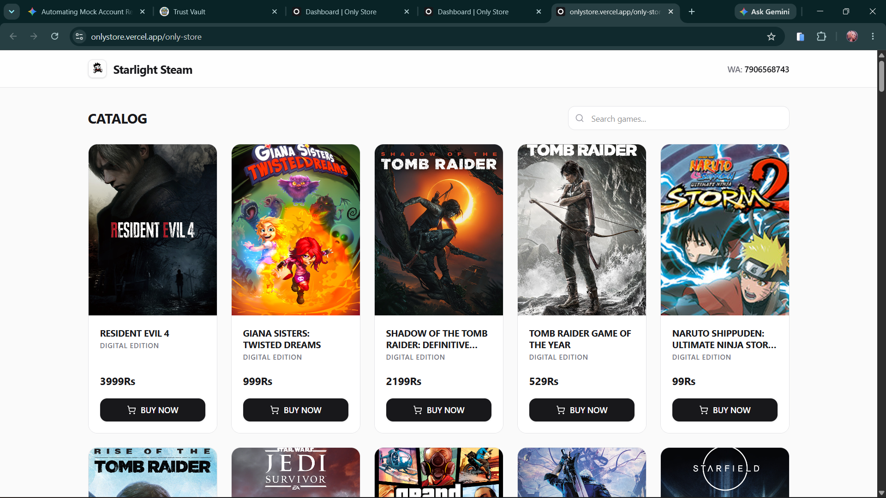
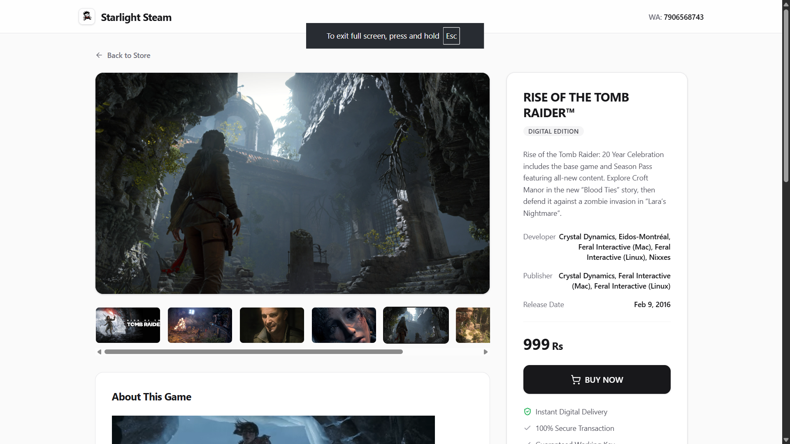
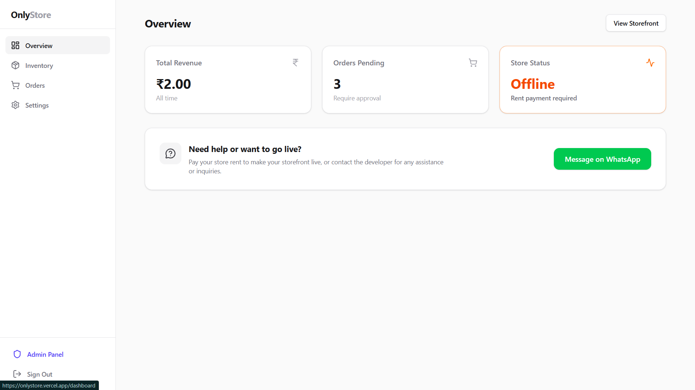
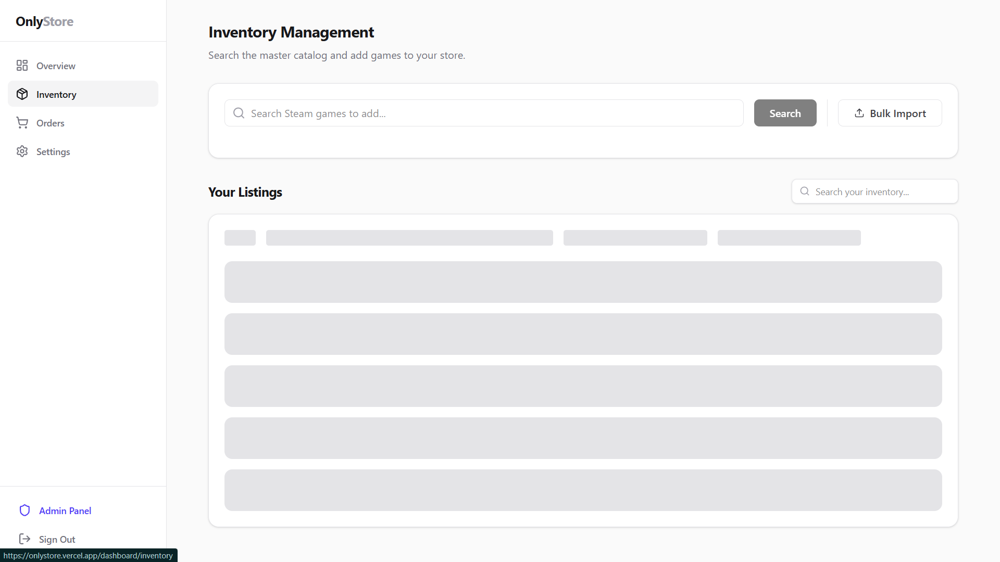
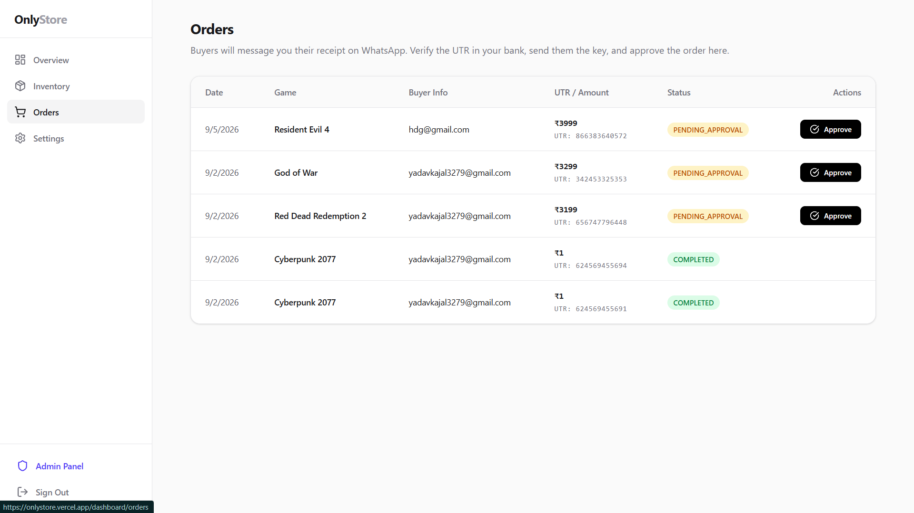
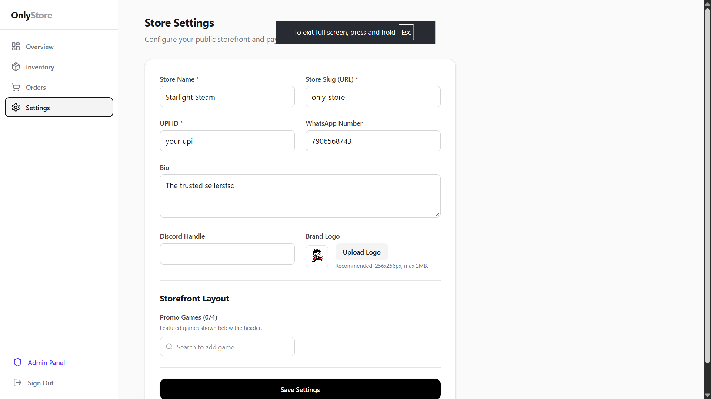

  <!-- A nice vibrant violet logo so it's visible on both dark and light modes -->
  

  <h1 align="center">Only Store</h1>

  

    <strong>Ultra-minimalist SaaS storefront for independent game key sellers.</strong>
     
    Effortlessly sell game keys, manage inventory, and process P2P UPI payments.
  

  
  

    <i>Developed with 💜 by <b>Adarsh</b></i>
  

  

    
    
    
    
  

  
  <h3>
    <a href="#-about-the-project">About</a>
     · 
    <a href="#-gallery">Gallery</a>
     · 
    <a href="#-key-features">Features</a>
     · 
    <a href="#-tech-stack">Tech Stack</a>
  </h3>

## 📖 About The Project

**Only Store** is a modern, ultra-minimalist platform tailored specifically for independent game key sellers. It empowers creators and sellers to host their own fully-functional, beautifully designed custom storefronts in seconds. 

Whether you're selling Steam keys, console codes, or gift cards, **Only Store** provides you with all the essential e-commerce tools—from inventory tracking to seamless peer-to-peer (P2P) UPI payments—without any of the traditional platform bloat or heavy fees. It is built to be fast, beautiful, and highly converting.

---

## 📸 Gallery

Here is a glimpse of the platform in action.

<table align="center">
  <tr>
    <td align="center">
      <b>Storefront Layout</b> 
      
    </td>
    <td align="center">
      <b>Game Details Page</b> 
      
    </td>
  </tr>
  <tr>
    <td align="center">
      <b>Dashboard Overview</b> 
      
    </td>
    <td align="center">
      <b>Inventory Management</b> 
      
    </td>
  </tr>
  <tr>
    <td align="center">
      <b>Orders Tracking</b> 
      
    </td>
    <td align="center">
      <b>Store Settings</b> 
      
    </td>
  </tr>
</table>

---

## ✨ Key Features

### 🏪 Branded Custom Storefronts
Get your own dedicated storefront URL (e.g., `/:store_slug`) featuring a minimalist, high-conversion design tailored for gamers.

### 💳 Zero-Fee P2P UPI Payments
Keep 100% of your earnings. We integrate direct Peer-to-Peer (P2P) UPI payments with dynamic QR code generation, so funds go straight into your bank account.

### 📦 Effortless Inventory & Orders
Manage your entire game catalog, adjust stock levels, and track live orders seamlessly through an intuitive and powerful **Seller Dashboard**. 

### 🤖 AI-Powered Integrations
Integrated with **Google Gemini AI** (`@google/genai`) to help automate store descriptions, marketing copy, and enhance customer interactions.

### 🛡️ Admin & Seller Management
A comprehensive built-in admin panel allows platform owners to manage sellers, oversee subscriptions, and ensure compliance.

---

## 💻 Tech Stack

Our tech stack is built for **speed, scale, and smooth user experiences**:

* **Frontend:** React 19, React Router v7, Tailwind CSS v4, Motion (for smooth micro-animations).
* **Backend:** Express.js running on Node.
* **Database & Auth:** Supabase (PostgreSQL + Auth).
* **AI:** Google Gemini API for intelligent storefront features.
* **Tooling:** Vite for lightning-fast builds, TypeScript for rock-solid type safety, and ESBuild.

 

  
Built with ❤️ by <b>Adarsh</b>.

